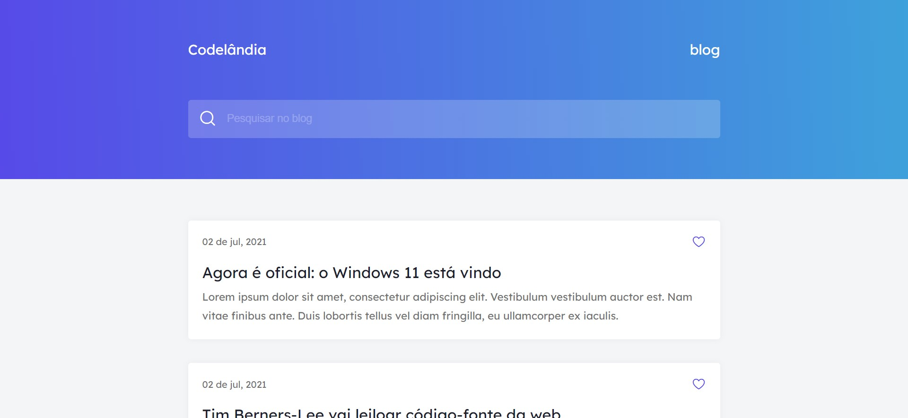

# Blog codelândia
 

Uma desafio front-end proposto pela comunidade codelândia, criar um blog simples com html e css.

> 🎯 Desafio #1

[Acesse aqui o site](https://ericodesenvolvedor.github.io/blog-desafio-codelandia/)

### Ferramentas utilizadas

- HTML
- CSS
- Figma

### Responsivo 

- Layout responsivo.

Criado com :heart: por 
  <a href="https://github.com/Ericodesenvolvedor">ericodesenvolvedor</a>

 
